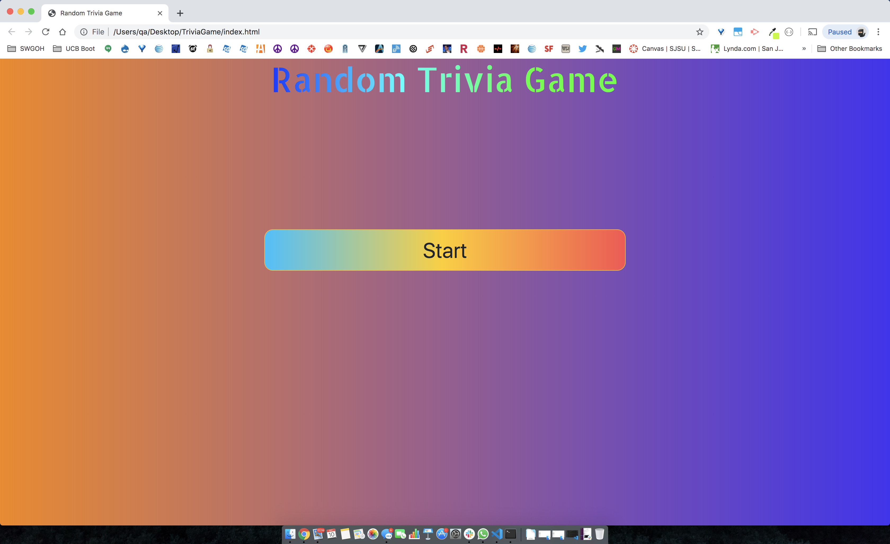

# Title: TriviaGame
## Site Picture:


## Technologies Used:
- HTML: Used to create elements 
- JavaScript: Used in the HTLM files and JS files
- CSS: Used to make to make the styling of the background image and colors & sizes
- Bootstrap: Used the button and rows/col-md to organize the html IDs. Also used animated gradients as a background
- Git: Used to document the changes of the source code
- GitHub: Used to create the repository for the html and css in which that can be pushed to GitHub domain

## Summary:
This assignment I executed all the jQuery DOM methods (.append, .on, .html, .show, .addClass, etc.) and timer functions (setInterval, setTimeout, etc) to create a trivia game. Similarly to creating a stopwatch, Creating dynmical variables within functions was the biggest challenge

## Code Snippet:
```html
           <!-- Trivia Answers Results Area -->
                    <div id=txtMsg></div>
                    <div id=rightAnswer></div>
                    <div id=imgAnswer></div>

            <!-- scoreTallyUp portion Area-->
            <div class="module-border-wrap" id="module">
                    <div id=lastMsg></div>
                    <div id=correctAnswer></div>
                    <div id=incorrectAnswers></div>
                    <div id=unanswerQ></div>
                </div>
</div>
            <!-- Restart Trivia Game Button -->
                    <div id="pressRestart"></div>


  
```


## Author Links:
[GitHub](https://github.com/duongsters)